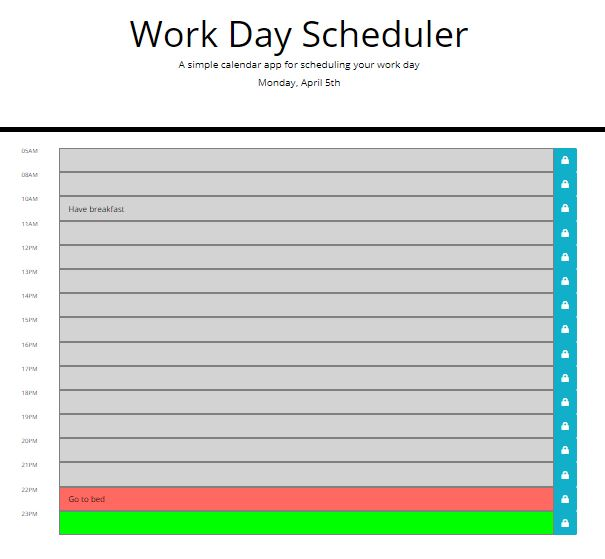

# 05 Work Day Scheduler

## The App Functionality

A simple calendar application that allows a user to save events for each hour of the day by modifying starter code. This app runs in the browser and features dynamically updated HTML and CSS powered by jQuery.

## User Story

AS AN employee with a busy schedule
YOU can add important events to a daily planner
SO THAT YOU can manage your time effectively

## Features

GIVEN you are using a daily planner to create a schedule
WHEN you open the planner
THEN the current day is displayed at the top of the calendar
WHEN you scroll down
THEN you are presented with timeblocks for standard business hours
WHEN you view the timeblocks for that day
THEN each timeblock is color coded to indicate whether it is in the past, present, or future
WHEN you click into a timeblock
THEN you can enter an event
WHEN you click the save button for that timeblock
THEN the text for that event is saved in local storage
WHEN you refresh the page
THEN the saved events persist

## The following images demonstrate the application functionality

## URLs

* The URL of the deployed application:
* The URL of the GitHub repository, with a unique name and a README describing the project: <https://github.com/mskippen/05-Work-Day-Scheduler.git>

© 2021 Project Agents Pty Ltd. Confidential and Proprietary. All Rights Reserved.
